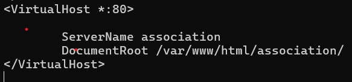
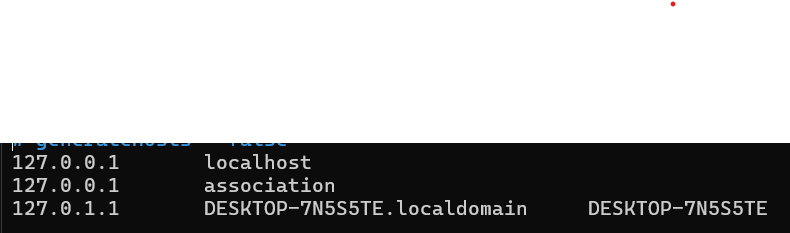
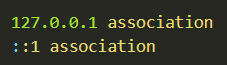
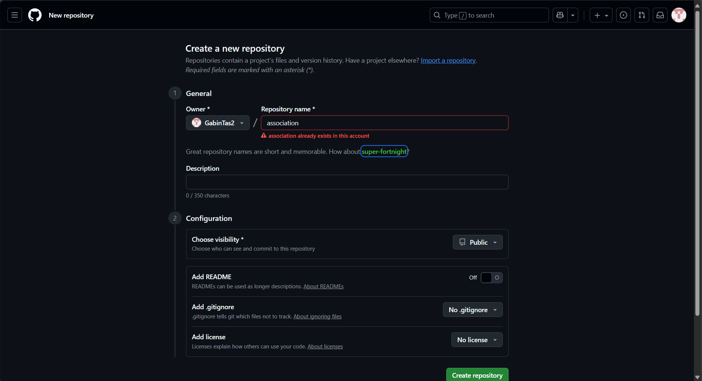
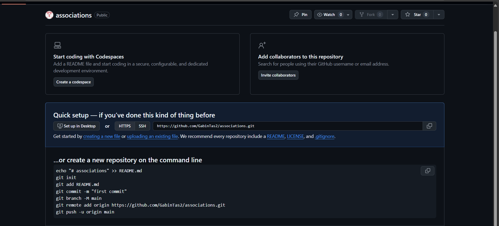

# Site Association Evaluation

## Table des matières 

- [Description du projet](#description-du-projet)
- [Table des matières](#table-des-matières)
- [Installation](#installation)
  - [Installation environnement virtuel Linux](#installation-environnement-virtuel-linux)
  - [Installation GitHub](#installation-github)
- [Technologies Utilisées](#technologies-utilisées)
- [Auteurs/Crédits](#auteurscrédits)

 ## Description du projet

Ce projet est un site internet Evalué pour la formation Developpeur Web et Web Mobile. J'ai décidé de faire un site internet sur le thème d'une association sportive multisport. Dans ce site on peut y retrouver:

- Page d'Accueil
- Page des différentes Activités
- Page d'Actualités 
- Page Contact

### Installation

#### Installation environnement virtuel Linux

Dans un premier temps, j'ai créé un dossier association

```bash
mkdir /var/www/html/association
```
J'ai en suite créer un lien vers un dossier que j'ai créer dans mon dossier perso pour éviter de devoir travaillé en sudo à chaque fois

```bash
sudo ln -s ~/association /var/www/html/association
```

j'ai ensuite modifié le fichier 000-default.conf qui se trouve dans ```/etc/apache2/sites-available```



J'ai par la suite modifé le fichier hosts qui se trouve dans ```/etc/hosts```



Puis faire la même chose sur le fichier hosts sur windows qui se trouve dans ```C:/Windows/System32/drivers/etc```



Pour finir, je vérifie en tapant

```bash
wslview http://association
```

#### Installation GitHub

1) Créer un repository sur GitHub

Sur GitHub, aller dans repository et cliquer sur "New" en haut à droite. 

Puis rensignez son nom avec une description et choisir si vous voulez qu'il soit publique ou privé



Ensuite aller dans votre espace de travail personnel puis tapé les commandes suivantes:



Votre espace git est maintenant installé.

#### Technologies Utilisées

Editeur de texte:
- Visual Studio code
- HTML 5
- CSS 3
- Mardown
- WSL (distribution Ubuntu)


#### Auteurs/Crédits

Personnes aillant travaillé sur le projet et lien GitHub:

- [Gabin Tas](https://github.com/GabinTas2)


